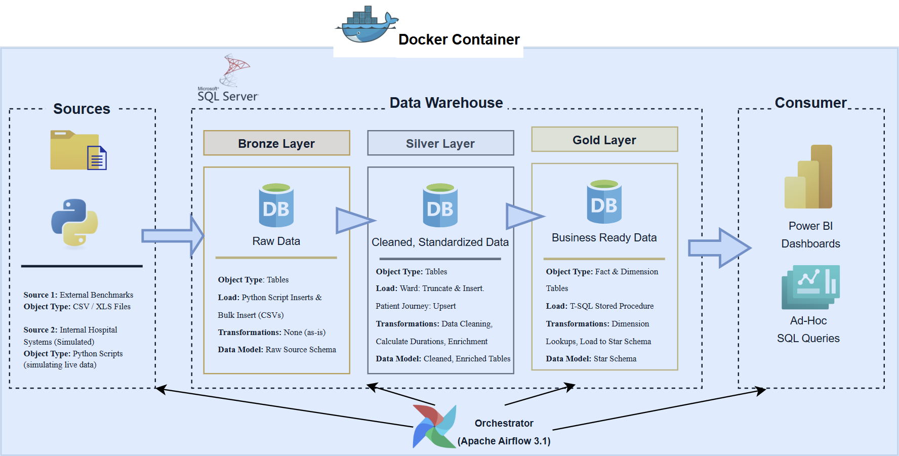

# 🏥 NHS A&E Data Pipeline: End-to-End Medallion Architecture


> **A robust, containerized ETL pipeline simulating and processing NHS Accident & Emergency patient data through a Bronze-Silver-Gold architecture.**

---

## 📖 Project Overview

This project demonstrates a complete Data Engineering solution designed to model the flow of patients through an NHS A&E department. It generates realistic synthetic data, orchestrates ingestion via **Apache Airflow**, and transforms data using **Microsoft SQL Server** to track critical KPIs like **Wait Times** and **Ward Occupancy**.

The system is built on the **Medallion Architecture** principle:
* **Bronze:** Raw data ingestion (simulated external benchmarks & internal systems).
* **Silver:** Cleaned, deduplicated, and enriched data (handling Upserts & Schema validation).
* **Gold:** Business-ready aggregations and Star Schema for reporting.

---

## 🏗️ Architecture



### The Workflow
1.  **Ingestion (Bronze):** Custom Python scripts simulate live hospital systems, generating patient arrivals and ward census data.
2.  **Orchestration:** Airflow DAGs (scheduled `@hourly`) trigger extraction and loading into MS SQL Server using the **ODBC Driver 18**.
3.  **Transformation (Silver):**
    * SQL `MERGE` statements handle data deduplication (Upserts).
    * Complex logic calculates durations (Arrival $\to$ Triage $\to$ Doctor).
    * Data is enriched with real-time Ward Occupancy snapshots.
4.  **Serving (Gold):** Optimized Fact and Dimension tables ready for visualization.

---

## 🛠️ Tech Stack

| Component | Technology | Description |
| :--- | :--- | :--- |
| **Containerization** | Docker & Docker Compose | Custom image build with MS ODBC Drivers & System dependencies. |
| **Orchestration** | Apache Airflow 3.1.3 | DAGs managing dependencies, retries, and Python/SQL tasks. |
| **Database** | Microsoft SQL Server | T-SQL for storage and transformation procedures. |
| **Language** | Python 3.12 | Data simulation, `OdbcHook` connectivity, and DAG definition. |
| **Driver** | MS ODBC Driver 18 | Linux-compatible driver for SQL Server connectivity. |

---

## 🚀 Key Features (Version 1.0)

* **Dockerized Airflow Environment:** A custom `Dockerfile` that extends the official Airflow image to include system-level dependencies (`unixodbc`) and the Microsoft ODBC Driver 18, solving common Linux-to-MSSQL connectivity challenges.
* **Production-Grade Connectivity:** Implements `OdbcHook` with properly configured connection strings (TrustServerCertificate/Encrypt) to bypass default security blocks.
* **Robust SQL Logic:** Utilizes T-SQL `MERGE` for idempotent operations—ensuring that re-running the pipeline doesn't create duplicate data.
* **Dynamic Configuration:** Uses Environment Variables for `PYTHONPATH` and Connection settings, keeping the codebase clean and modular.

---

## 📂 Project Structure

```bash
├── dags/
│   └── ae_medallion_pipeline_dag.py  # Main orchestration logic
├── python_scripts/
│   ├── patient_ae_journey.py         # Data simulator for patient flow
│   └── ward_occupancy.py             # Data simulator for ward census
├── sql/
│   ├── bronze_to_silver.sql          # T-SQL transformations
│   └── silver_to_gold.sql            # Aggregation logic
├── assets/
│   └── architecture_diagram.png      # Visualization
├── Dockerfile                        # Custom image build
├── docker-compose.yaml               # Service definitions
└── requirements.txt                  # Python dependencies
```
## 🗺️ Roadmap

### ✅ v1.0: Backend Core (Completed)
* [x] Docker environment setup with MS SQL connectivity.
* [x] Python Simulation scripts for Patient Journey & Ward Occupancy.
* [x] Airflow DAGs for Bronze $\to$ Silver $\to$ Gold pipeline.
* [x] T-SQL transformation logic implementation.

### 🚧 v1.1: Analytics Integration (Coming Soon)
* [ ] Connect Power BI Service to the Gold Layer.
* [ ] Develop **Wait Time vs. Occupancy** Dashboard.
* [ ] Implement Airflow `PowerBIDatasetRefreshOperator` to trigger dashboard updates immediately after ETL completion.

---

## 💻 How to Run Locally

1.  **Clone the Repository**
    ```bash
    git clone https://github.com/Manjunathask/nhs-ae-pipeline-project.git
    cd nhs-ae-pipeline
    ```

2.  **Build & Start**
    ```bash
    docker compose up -d --build
    ```

3.  **Access Airflow**
    Navigate to `http://localhost:8080` and trigger the `nhs_ae_etl_pipeline` DAG.

---

## 📬 Contact

I am currently open to Data/Analytics Engineering opportunities. Feel free to reach out!

* **Name:** Manjunatha S K
* **LinkedIn:** [linkedin.com/in/manjunatha-s-kl](https://www.linkedin.com/in/manjunatha-s-k/)
* **Email:** [skmanjunath16@gmail.com](mailto:skmanjunath16@gmail.com)

---
*Project Version: 1.0 | Last Updated: Nov 2025*
